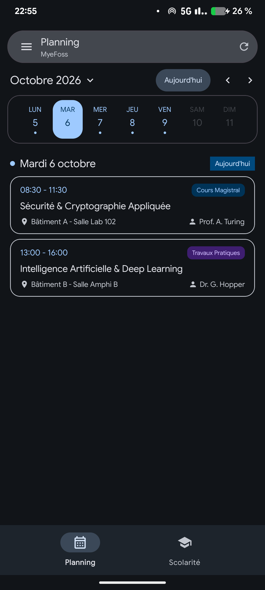
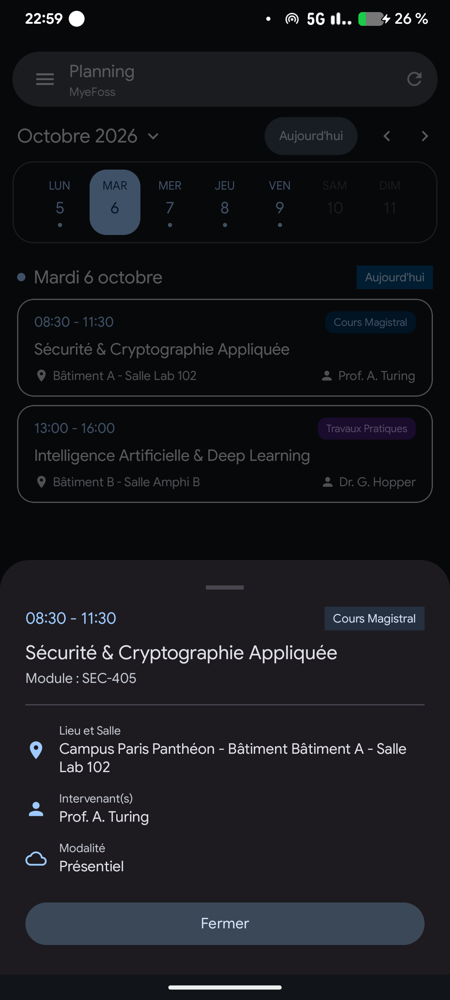
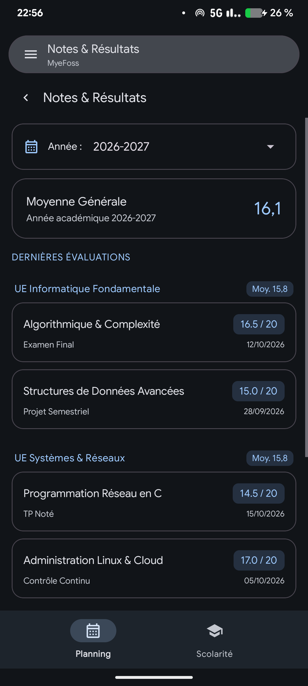
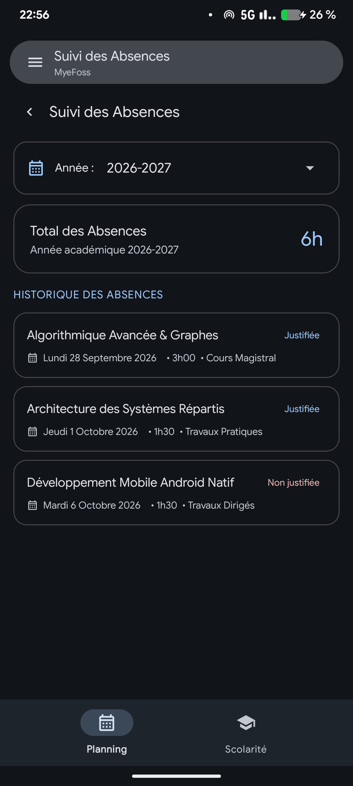
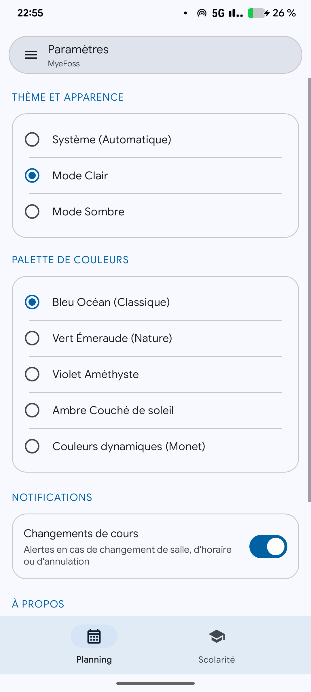
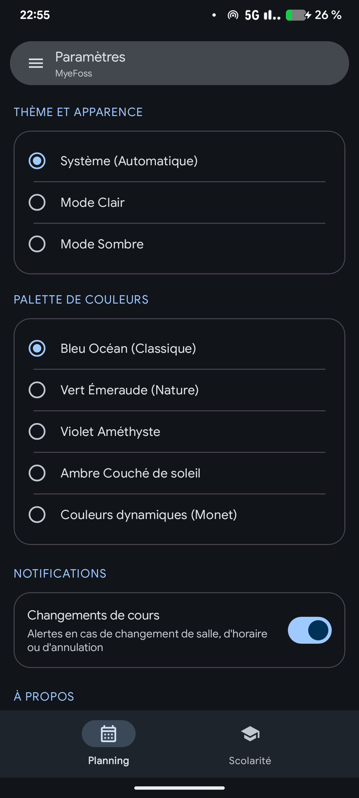
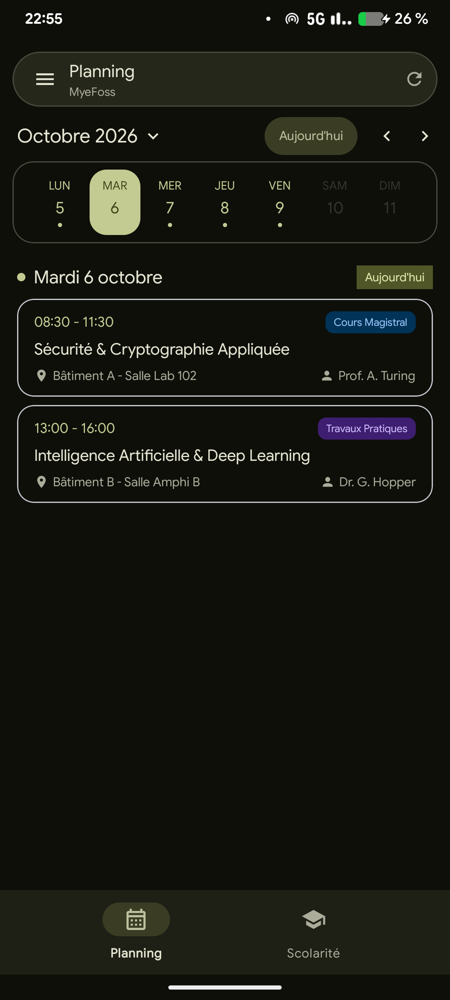
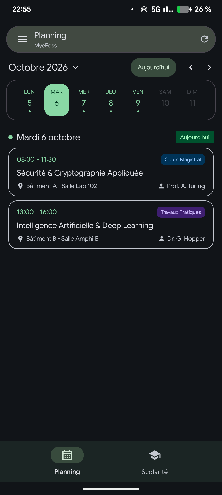
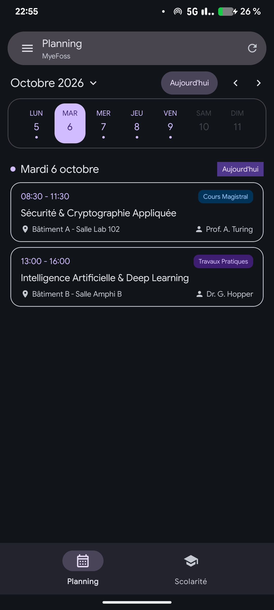
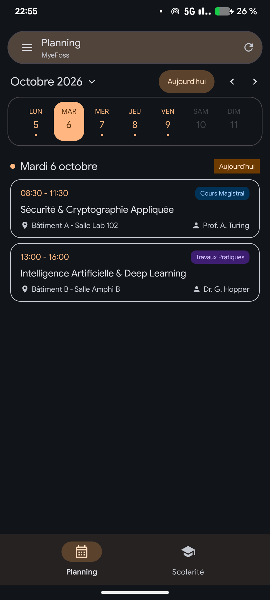

<div align="center">

  

  # MyeFoss

  **A modern, privacy-respecting and open-source Android client for Efrei students.**

  [](https://github.com/myeFoss/MyeFoss/releases/latest)
  [](https://github.com/myeFoss/MyeFoss/actions)
  [](https://android.com)
  [](https://kotlinlang.org)
  [](https://m3.material.io)
  [](LICENSE)

  <p align="center">
    MyeFoss brings a clean Material 3 interface, offline capabilities, dynamic themes, and scolarity features together into a lightweight native mobile experience.
  </p>

</div>

## Why MyeFoss ?

In the GAFAM days, I decided long ago to migrate to a more privacy-focused rom on my android device. LineageOS it is.  
Unfortunately, the official MyEfrei app relies on Google's PlayIntegrity API to determine wether the device is "certified" by Google.  

Which, basically, means that if Google doesn't give his permission, then I can't use my MyEfrei app on my device.  

I could be using the website, and that's what I've done for years already. But when I get into the building in the morning, and that I'm in the rush because I'm eventually late, I often don't have internet for some mysterious reason; So I can't know where to go; So I lose time.  

That's why I decided to write MyeFoss. (FOSS as in **F**ree and **O**pen **S**ource **S**Oftware).

## DISCLAIMER !! 

I am **NOT** affilated with the school's administration by any means. Really.  
Altho I think (and genuinely hope) they won't take it badly, please rest assured there is no bad thinking behind this app. It's sole purpose is efficiency in my daily life. Nothing more, Nothing less. And if anything is problematic, I will be happy to exchange about it using my student email or at onelots@onelots.fr


Something else : I **DO NOT** see anything. There are no stats, no tracking, nothing.  
And better : I use MyEfrei's authentication portal to authenticate. There is no willing to bypass anything, nor to harm anything, nor, even worse, to use a less-secured way to do what I want to do.

## Ok Cool, but how does it work ?

MyeFoss works in a very simple way, which is described below :

```
    [1. SSO Connection]
    User clicks "Se connecter" 
           │
           ▼
    WebView opens https://www.myefrei.fr/auth/efrei?redirectPath=portal%2Fstudent%2Fplanning
           │
           ▼
    Use of MyEfrei's authentication portal
           │
           ▼
    [2. REST Request]
    HttpURLConnection sends a get request :
           URL : https://www.myefrei.fr/api/rest/student/planning?startDate={ISO}&endDate={ISO}
           │
    [3. Deserialization & Parsing]
    Raw JSON received is parsed and stuff in there such as below is extracted :
           ├── ID, Class name, Module
           ├── Time for start and end, room
           ├── Activity type (Class, TD, TP, Finals...)
           ├── Physical or online ? (in_person, online...)
           ├── Rooms (campus, bat, room)
           └── Teachers
           │
    [6. Displaying stuff]
    Classes are displayed
    If today's date is present, mainView automatically scrolls on it
```


## AI or no AI, here is the question...

Ah, you got me... Yes, AI.  
I actually am not an app developper at the very beginning, so I have to admit I used Gemini a lot while building this app. It helped me putting everything together to have a nice app in the end. And moreover, it wrote the part below about the features and all.  

I am not hiding it. On every commit using AI, I append `Assisted-By: LLM`, as per required by The Linux Kernel charter.  

Altho I heavily used AI, I am still the master here. I control my tool, and my tool doesn't control me. I make my best to review everything it submits, and make sure it's not stupid.

---

## Features

- **Planning & Timetable**:
  - Interactive week and month calendar views.
  - Quick day switcher and current class highlights.
  - Detailed bottom sheet with course activities, rooms, campuses, and teachers.
- **Offline First**:
  - Full local caching for schedules, grades, and absences.
  - Zero redundant network requests; only fetches updates when necessary or upon pull-to-refresh.
- **Scolarity Hub**:
  - **Grades & Results**: Academic year filter, unit breakdown (UE), and general average calculator.
  - **Absence Tracking**: Comprehensive attendance history, hours summary, and justification statuses.
- **Background Course Change Alerts**:
  - Battery-friendly periodic background sync using Android WorkManager.
  - Instant notifications for room changes, rescheduled classes, or cancellations.
- **Material You & Theming**:
  - Android 12+ dynamic theming (Monet / system palette).
  - Built-in curated palettes (Emerald, Purple, Amber) and Day/Night mode toggles.
- **Over-The-Air (OTA) Updates**:
  - Integrated GitHub Releases checker and in-app installer.
- **Session Privacy**:
  - Direct web-based single sign-on (SSO).
  - Explicit logout with complete local cookie and cache purging.

---

## Screenshots

### Core Experience
<div align="center">

| Planning | Course Details | Grades & Average | Absences Tracking |
| :---: | :---: | :---: | :---: |
|  |  |  |  |

</div>

<details>
<summary><b>🎨 Theme Palettes & Customization (Click to expand)</b></summary>
<br>

<div align="center">

| Light Theme | Dark Theme |
| :---: | :---: |
|  |  |

<br>

| Monet (System) | Emerald | Amethyst | Amber |
| :---: | :---: | :---: | :---: |
|  |  |  |  |

</div>

</details>

---

## Installation

### Download APK
Grab the latest release from the [GitHub Releases](https://github.com/myeFoss/MyeFoss/releases) page:
- `MyeFoss.apk` (Release build, recommended)
- `MyeFoss-debug.apk` (Debug build for testing)

### Build from Source

#### Prerequisites
- JDK 17
- Android SDK (API Level 34)

#### Steps
```bash
# Clone the repository
git clone https://github.com/myeFoss/MyeFoss.git
cd MyeFoss

# Build debug APK
./gradlew assembleDebug

# Build release APK
./gradlew assembleRelease
```
Compiled APKs are outputted to `app/build/outputs/apk/`.

---

## Architecture & Tech Stack

- **Platform**: Native Android (Kotlin)
- **UI & Components**: Material Components 3, View Binding, SwipeRefreshLayout
- **Background Tasks**: Android Jetpack WorkManager
- **Storage & Cache**: Local JSON cache with memory-first lookups
- **Networking**: Native HTTP / URLConnection with cookie handling
- **CI/CD**: GitHub Actions automated workflow for building and publishing artifacts

---

## Contributing

Contributions and feedback are welcome!
1. Fork the project.
2. Create your feature branch (`git checkout -b feature/my-feature`).
3. Commit your changes following short, conventional commit messages (`subsystem: action`).
4. Push to the branch (`git push origin feature/my-feature`).
5. Open a Pull Request.

---

## Disclaimer

This application is an independent, open-source project and is **not** officially affiliated with, endorsed by, or associated with Efrei Paris. All trademarks and brand names belong to their respective owners.

---

## License

This project is licensed under the terms of the MIT License.
